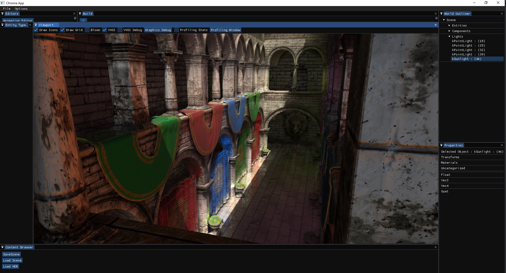

# ChromaEngine
## Open Source Game Engine
Personal Education Project focusing on software architecure, realtime rendering, animation systems, ai and design patterns. 
[Youtube Devlogs](https://www.youtube.com/watch?v=YeyiEYRT1Ac)

## Features

  * Bullet Physics.
  * Skeletal Animation and basic state machine. 
  * Bipedal Third Person Character and Camera Controller.  
  
## Rendering

  * Voxel Based Global Illumination (Experimental).
  * PBR Shading.
  * IBL HDR lighting.
  * SSR
  * SSAO
  * Transparent Rendering and Sorting.
  * Deffered and Forward Rendering Pipelines.
  
## Editor

  * Serialization and deserialization of scene objects using rapidJson. 
  * Entity selection and property serialization. 
  * Multithreaded resource loading. 

