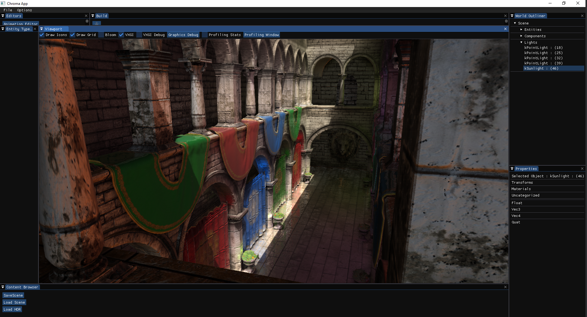

# ChromaEngine
ChromaEngine is a real-time 3D rendering engine written in C++ with OpenGL and Vulkan interfaces, featuring a physically-based rendering pipeline, voxel-based global illumination, skeletal animation with state machines, and an ImGui-based scene editor with JSON serialisation.
[Youtube Devlogs](https://www.youtube.com/watch?v=YeyiEYRT1Ac)

## Rendering

* Voxel Based Global Illumination.
* PBR Shading.
* IBL HDR lighting.
* SSR
* SSAO
* Transparent Rendering and Sorting.
* Deffered and Forward Rendering Pipelines.
* Debug drawing.

## Features

  * Bullet Physics.
  * Skeletal Animation and basic state machine. 
  * Bipedal Third Person Character and Camera Controller.
    
## Editor

  * Serialization and deserialization of scene objects using rapidJson. 
  * Entity selection and property serialization. 
  * Multithreaded resource loading. 
